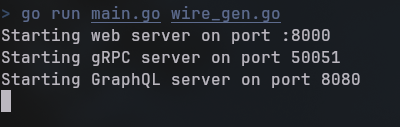
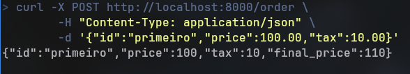
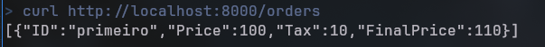
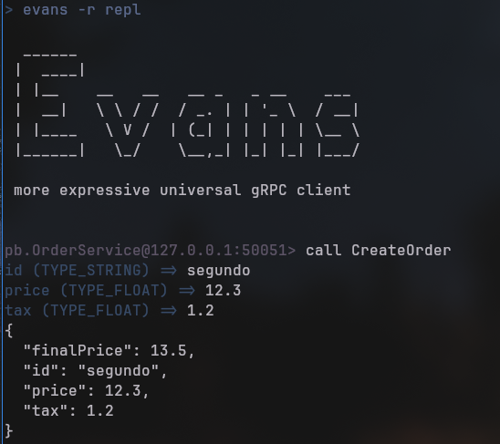
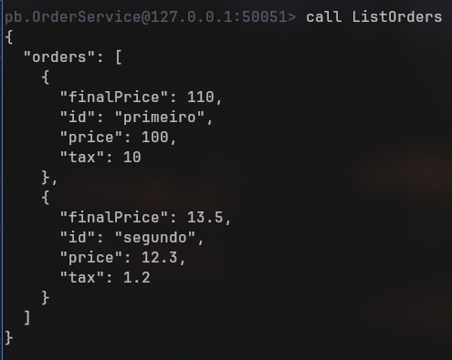
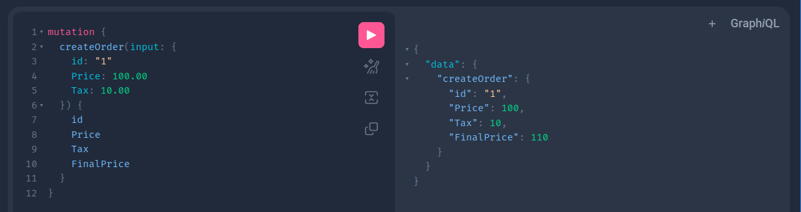
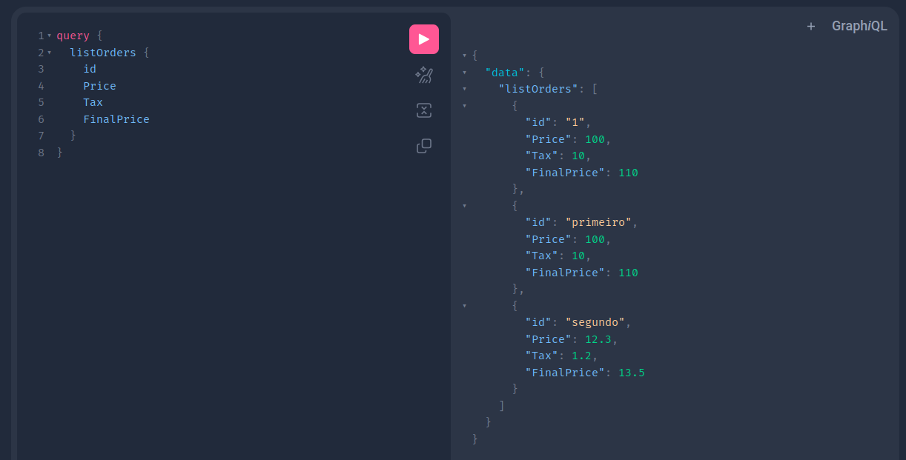

# Clean Architecture

Este projeto implementa um sistema de gerenciamento de pedidos utilizando Clean Architecture, demonstrando a integração de múltiplos protocolos de comunicação (REST, gRPC, GraphQL) e message broker (RabbitMQ).

## 🌟 Funcionalidades

- Criação e listagem de pedidos via:
  - REST API
  - gRPC
  - GraphQL
- Eventos assíncronos usando RabbitMQ
- Persistência em MySQL
- Clean Architecture
- Testes automatizados

## 🛠️ Tecnologias

- Go 1.21+
- MySQL 8.0
- RabbitMQ 3
- Docker & Docker Compose
- gRPC
- GraphQL (gqlgen)
- Wire (Dependency Injection)
- Chi Router (REST)

## 📋 Pré-requisitos

- Go 1.21 ou superior
- Docker e Docker Compose
- Make (opcional, mas recomendado)

## 🚀 Configuração e Execução

### 1. Clone o repositório

```bash
git clone https://github.com/wanderlei2583/cleanArquiteture.git
cd cleanArquiteture
```

### 2. Configure as variáveis de ambiente

Crie um arquivo `.env` na raiz do projeto:

```env
DB_DRIVER=mysql
DB_HOST=localhost
DB_PORT=3306
DB_USER=root
DB_PASSWORD=root
DB_NAME=orders
WEB_SERVER_PORT=8000
GRPC_SERVER_PORT=50051
GRAPHQL_SERVER_PORT=8080
```

### 3. Inicie os serviços de infraestrutura

```bash
docker-compose up -d
```

### 4. Execute as migrações do banco de dados

As migrações são executadas automaticamente ao iniciar o container MySQL.

### 5. Compile e execute o projeto

```bash
go mod tidy
cd cmd/ordersystem
go run main.go wire_gen.go
```


## 📡 Endpoints e Serviços

### REST API (porta 8000)

- **Criar Pedido**
  ```bash
  curl -X POST http://localhost:8000/order \
    -H "Content-Type: application/json" \
    -d '{"id":"primeiro","price":100.00,"tax":10.00}'
  ```


- **Listar Pedidos**
  ```bash
  curl http://localhost:8000/orders
  ```


### gRPC (porta 50051)

Use um cliente gRPC como [evans](https://github.com/ktr0731/evans) para testar:

```bash
evans -r repl

call CreateOrder
```


```bash
call ListOrders
```



### GraphQL (porta 8080)

Acesse o playground: http://localhost:8080

Mutation para criar pedido:
```graphql
mutation {
  createOrder(input: {
    id: "1"
    Price: 100.00
    Tax: 10.00
  }) {
    id
    Price
    Tax
    FinalPrice
  }
}
```

Query para listar pedidos:
```graphql
query {
  listOrders {
    id
    Price
    Tax
    FinalPrice
  }
}
```


## 📐 Arquitetura

O projeto segue os princípios da Clean Architecture:

```
.
├── cmd/
│   └── ordersystem/
│       ├── main.go
│       ├── wire.go
│       └── wire_gen.go
├── configs/
│   └── config.go
├── img/
│   ├── img01.jpg
│   ├── img02.jpg
│   └── img03.jpg
│   └── img04.jpg
│   └── img05.jpg
│   └── img06.jpg
│   └── img07.jpg
├── internal/
│   ├── entity/
│   │   ├── interface.go
│   │   ├── order.go
│   │   └── order_test.go
│   ├── event/
│   │   ├── handler/
│   │   │   └── order_created_handler.go
│   │   └── order_created.go
│   ├── infra/
│   │   ├── database/
│   │   │   ├── order_repository.go
│   │   │   └── order_repository_test.go
│   │   ├── graph/
│   │   │   ├── model/
│   │   │   │   └── models_gen.go
│   │   │   ├── generated.go
│   │   │   ├── resolver.go
│   │   │   ├── schema.graphqls
│   │   │   └── schema.resolvers.go
│   │   ├── grpc/
│   │   │   ├── pb/
│   │   │   │   ├── order.pb.go
│   │   │   │   └── order_grpc.pb.go
│   │   │   ├── protofiles/
│   │   │   │   └── order.proto
│   │   │   └── service/
│   │   │       └── order_service.go
│   │   └── web/
│   │       ├── order_handler.go
│   │       └── webserver/
│   │           ├── webserver.go
│   │           └── starter.go
│   └── usecase/
│       ├── create_order.go
│       └── list_orders.go
├── migrations/
│   └── 01_init.sql
├── pkg/
│   └── events/
│       ├── event_dispatcher.go
│       ├── event_dispatcher_test.go
│       └── interface.go
├── tools.go
├── .gitignore
├── .env
├── docker-compose.yaml
├── gqlgen.yml
├── go.mod
├── go.sum
└── README.md
```

- `entity`: Regras de negócio da empresa
- `usecase`: Regras de negócio da aplicação
- `infra`: Adaptadores para frameworks e drivers
- `pkg`: Código compartilhado e utilitários
- `configs`: Configurações da aplicação

## 🔄 Event-Driven

O sistema utiliza RabbitMQ para eventos assíncronos:

- Quando um pedido é criado, um evento `OrderCreated` é publicado
- Um handler processa o evento e realiza ações adicionais

## 📝 Licença

Este projeto está sob a licença MIT. Veja o arquivo [LICENSE](LICENSE) para mais detalhes.

